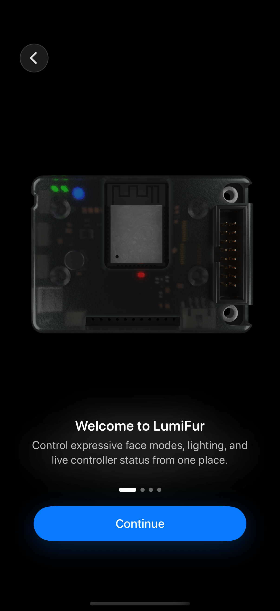
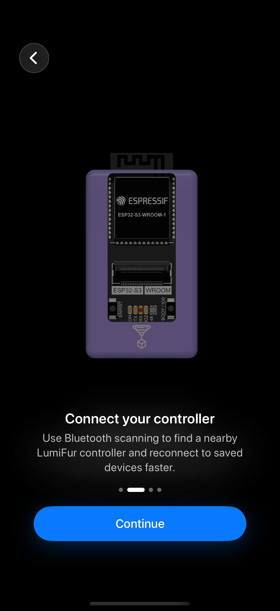
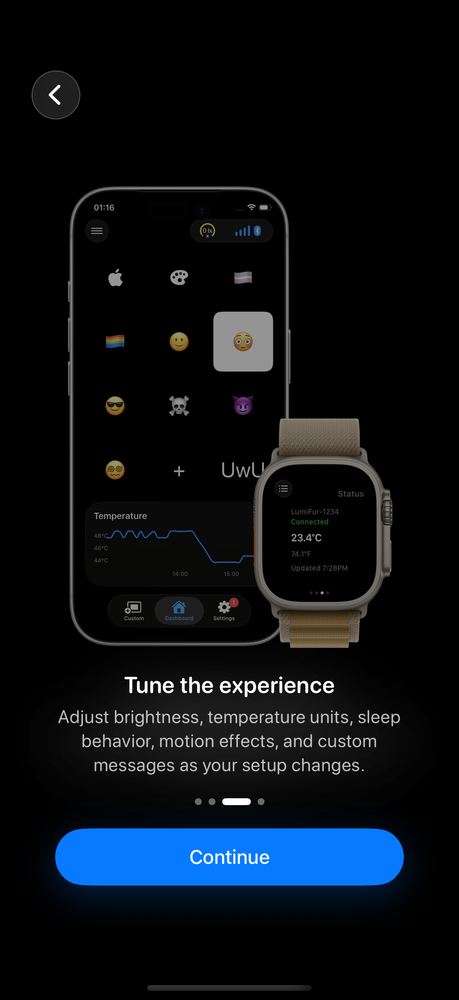
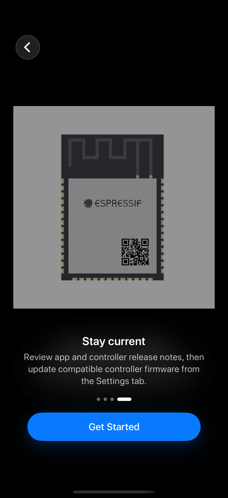
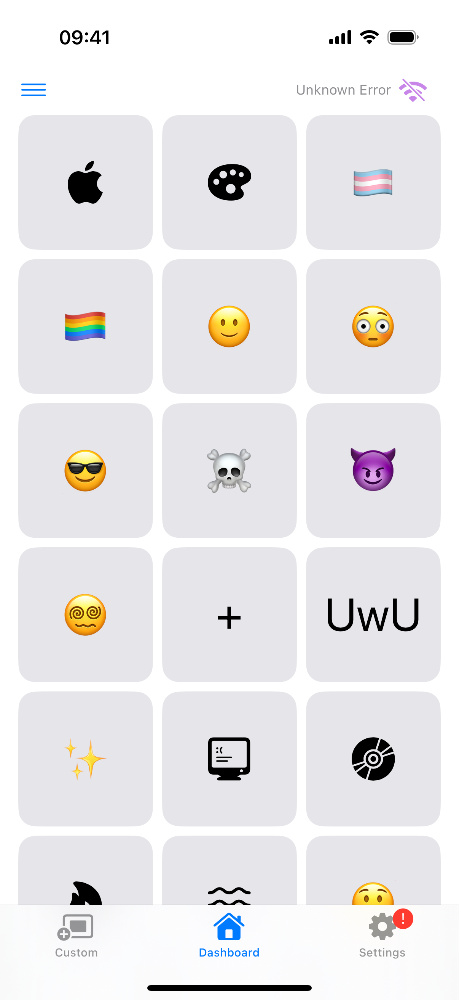
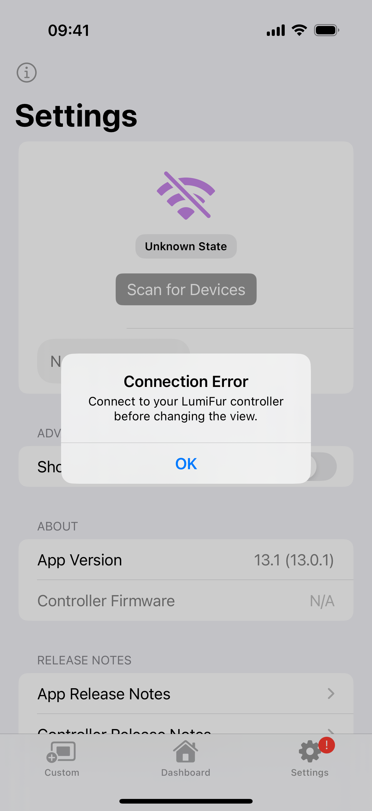
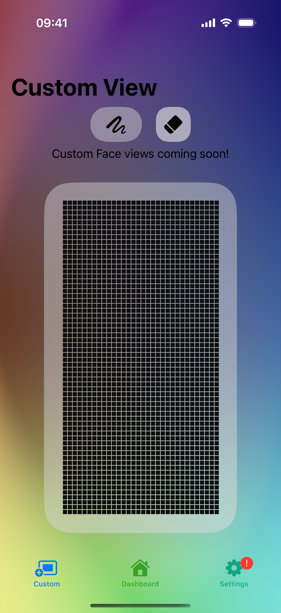

# LumiFur design audit

Date: 31 August 2026

## Verdict

LumiFur has a distinctive, coherent onboarding experience and a sound native SwiftUI foundation. The watch app is especially disciplined. The main iPhone experience becomes much less Apple-native after onboarding: disconnected hardware is represented by an enabled-looking dashboard, important status is vague, quick controls use decorative pills instead of semantic controls, and the Custom tab exposes an unfinished, fixed-size editor.

The highest-value redesign is not a new visual system. It is a clearer state model: make connection state the primary hierarchy, show only controls that can currently work, and let native SwiftUI components provide interaction, accessibility, and platform adaptation.

## Scope and evidence

- Active project: `LumiFur.xcodeproj`.
- Supported UI targets found: iPhone and iPad (minimum iOS 17.6), widget (iOS 18.2 target), and a dedicated Apple Watch app (watchOS 26 target). There is no native macOS or tvOS target.
- The production app built successfully with Xcode 26.6.
- The eight-step first-run/disconnected flow was exercised on an iPhone 16 Pro simulator running iOS 18.6.
- The iOS 26 Liquid Glass availability path, iPad layout, watch app, and widget were source-reviewed. The iOS 26 simulator remained in first-boot data migration, so that appearance was not accepted visually.
- A connected physical LumiFur controller was unavailable, so connected, OTA, live chart, and successful command states were not visually verified.
- VoiceOver, Switch Control, Full Keyboard Access, and the complete Dynamic Type range still need device-level verification.
- No production code was changed. The temporary UI-capture harness was removed after the audit.

## Flow health

1. **Welcome — Good.** Strong product identity, concise copy, obvious primary action, and a clear page indicator. The dark controller render is slightly lost against pure black.
2. **Connect your controller — Good.** The controller image and copy explain the hardware relationship well. The always-visible Back button is misleading on the first page and the layout relies on fixed height proportions.
3. **Tune the experience — Good with reservations.** It previews the ecosystem and communicates breadth, but the composite product image is visually busier than the other onboarding art.
4. **Stay current — Mixed.** The message is clear, but the low-detail chip image looks like a technical placeholder and weakens the polished sequence.
5. **Disconnected dashboard — Poor.** The screen looks fully actionable despite unavailable hardware, says “Unknown Error,” offers no primary recovery action, and gives equal weight to every face.
6. **Disconnected quick controls — Poor.** Disabled controls still resemble active colorful pills, status is communicated largely through color, and the surface explains neither why actions are unavailable nor how to connect.
7. **Settings and connection error — Mixed.** The underlying `List`, sections, release notes, and version rows are native and legible. The custom connection card is visually heavy, “Unknown State” is vague, the permanent tab badge is unexplained, and a common disconnected action becomes a blocking alert.
8. **Custom editor — Poor.** It is visibly unfinished, occupies a top-level tab, uses a large custom gradient and floating glass controls, and its 500-point rotated canvas is not adaptive.

## Captures

| Welcome | Connect | Tune | Updates |
|---|---|---|---|
|  |  |  |  |

| Dashboard | Quick controls | Settings/error | Custom editor |
|---|---|---|---|
|  |  |  |  |

## What is working

- `TabView`, navigation stacks, `List`, `Section`, `Label`, SF Symbols, semantic destructive roles, and system presentation APIs provide a good base.
- The onboarding has a consistent visual rhythm, concise copy, clear progress, large targets, and useful accessibility hiding for off-page content.
- Settings uses a native scrolling list and progressively reveals controller-specific configuration only when connected.
- The watch app is the most platform-native surface: a glanceable `List`, one clear controller action, concise status rows, native navigation, a disconnected `ContentUnavailableView`, and explicit accessibility labels and values for face selection.
- The widget adapts by family and uses semantic labels and system widget backgrounds.

## Priority findings

### P0 — Make disconnected state the dashboard, not a toolbar error

The first post-onboarding screen shows a large enabled-looking face grid while the toolbar says “Unknown Error.” A person has to infer that Settings contains connection controls. Selecting an unavailable face eventually produces a modal error.

Replace the grid while disconnected with a native `ContentUnavailableView` containing a specific state, short explanation, and **Scan for Controllers** or **Open Settings** action. Use deterministic labels such as **Disconnected**, **Bluetooth Off**, **Scanning**, and **Couldn’t Connect**. Keep the grid and quick controls disabled or absent until commands are valid.

This aligns with Apple’s recommendation to use content-unavailable views when content cannot be displayed and to avoid interruptive alerts for information that can be communicated in context.

### P0 — Do not ship the current Custom tab as a primary destination

The screen says the feature is coming soon, but presents a detailed editor that appears usable. The implementation uses gesture-only icon images, fixed-width controls, a 500-point rotated drawing surface, and custom glass containers.

Until the editor is complete, replace it with a restrained `ContentUnavailableView` or omit the tab. For the finished editor, use semantic `Button`, `Picker`, `Slider`, `ColorPicker`, toolbar actions, an adaptive canvas aspect ratio, and clear selection states. Provide a confirmation for clearing the canvas.

### P1 — Replace decorative quick-control pills with semantic state controls

Use a compact `Form`, `List`, or `ControlGroup` with native `Toggle` rows. Keep color as character, not as the only on/off signal. When disconnected, show one inline explanation and connection action instead of five disabled controls. The custom LumiFur wordmark can remain as branding, but it should not dominate control chrome.

### P1 — Remove the permanent Settings exclamation badge

The red badge looks like an unresolved error on every launch, but its meaning and resolution are not exposed. Show a badge only for a real, actionable, transient condition such as an available firmware update, and clear it when the condition is resolved. Connection state already has a dedicated status surface.

### P1 — Clarify hierarchy and selection in the face browser

Add a screen title such as **Faces**, use a visible selected marker in addition to inversion, and provide accessible names and values for every tile. The grid can be denser without turning every item into a large floating card. Use lighter haptic selection feedback rather than a heavy impact for every choice.

The chart expander should be a `Button` or `DisclosureGroup`, not an unlabeled tap gesture on the entire chart.

### P1 — Preserve the onboarding design while removing its fragility

Hide or disable the Back control on page one; optionally add Skip for people who already understand the hardware. Replace proportional fixed-height regions and restrictive line limits with content-driven layout that survives accessibility sizes. Respect Reduce Motion for the custom spring, blur, scale, and scroll transitions. Improve the final controller-chip asset so it matches the fidelity of the first three pages.

### P2 — Simplify the connection section in Settings

The native `List` is a strong choice. The connection area should follow it: use a standard section with a status row, progress state, scan button, and discovered-device rows instead of a card embedded inside a list. Treat a missing connection as a normal state; reserve alerts for critical or genuinely actionable failures.

## Platform review

### iPhone

The three-tab information architecture is understandable and touch targets are generous. The main weakness is state hierarchy, not navigation. Restore a clear title, put connection recovery in reach, and let system controls carry interaction states.

### iPad

The iPad currently shares the same three-tab hierarchy; only quick-control presentation adapts by horizontal size class. The face grid expands, but the Custom editor remains fixed. Consider an availability-gated `sidebarAdaptable` tab style or `NavigationSplitView` for wide windows, while preserving the compact tab view. Validate narrow Stage Manager windows and keyboard focus.

### Apple Watch

The watch architecture already follows the right pattern and should be the benchmark for the phone: immediate status, one primary controller action, short hierarchy, native lists, and explicit disconnected guidance. Verify the two-column face grid on the smallest supported watch and at 140% text size.

### Widget

Family-specific layouts and semantic labels are sound. The large widget’s chart adds another material card inside the widget and may be visually heavier than necessary; verify real disconnected and stale-data states, not only placeholder data.

## Accessibility risks

- Face tiles lack explicit accessible labels, selected values, and hints in the iPhone implementation.
- Quick-control pills communicate on/off state through gradients and do not expose an explicit textual value.
- Custom-editor tools are gesture-driven images rather than semantic buttons; the canvas needs an accessible alternative or meaningful summary.
- Onboarding text is constrained with line limits and minimum scale factors, which can undermine Dynamic Type.
- Custom motion does not read `accessibilityReduceMotion`.
- The permanent red badge and connection colors do not explain status independently of color.
- The fixed custom font size in quick controls and fixed custom-editor dimensions are poor fits for larger text and small windows.

## Recommended implementation order

1. Introduce a single, explicit dashboard state model and native disconnected/permission/error recovery view.
2. Disable or remove unavailable actions, remove the permanent badge, and replace common-state alerts with inline feedback.
3. Make face cells and chart expansion semantic and accessible.
4. Replace or temporarily hide the unfinished Custom editor.
5. Refactor quick controls into native toggles.
6. Add Reduce Motion and Dynamic Type coverage, then validate iPad widths, watch sizes, and connected hardware states.

## Apple references

- [Human Interface Guidelines](https://developer.apple.com/design/human-interface-guidelines)
- [Accessibility](https://developer.apple.com/design/human-interface-guidelines/accessibility)
- [Alerts](https://developer.apple.com/design/human-interface-guidelines/alerts)
- [Tab bars](https://developer.apple.com/design/human-interface-guidelines/tab-bars)
- [Sidebars](https://developer.apple.com/design/human-interface-guidelines/sidebars)
- [Layout](https://developer.apple.com/design/human-interface-guidelines/layout)
- [`ContentUnavailableView`](https://developer.apple.com/documentation/swiftui/contentunavailableview)
